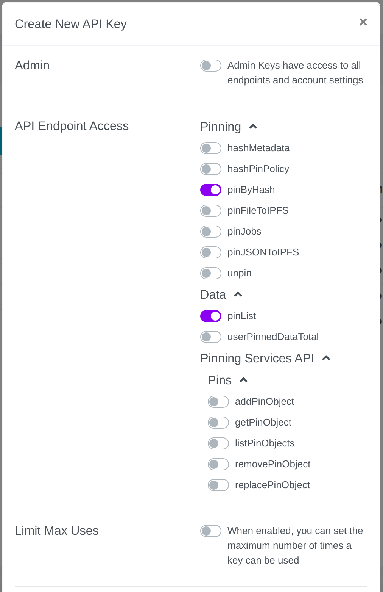

# DXvote

Application for voting and govern DXdao, focused on technical decentralization (fetching all data from ethereum network, ipfs or static configuration files). 

## Add Pinata Service

1.- Register in https://auth.pinata.cloud/signup

2.- Login in https://auth.pinata.cloud/login

3.- Go to https://pinata.cloud/keys and click in "New Key".

4.- Allow API Endpoints `pinByHash` in Pinning and `pinList` in Data.

5.- Enter a Key Name, click "Create Key" button and **dont close the "API Key Info" window**.

6.- The information you are seeing will be displayed only once, copy the **JWT key** into the Pinata key in [/config](https://augustol.github.io/dxvote/#/config) in dxvote.

## Development

Will build the dapp with the development configuration, deploying all dxdao contracts in a local network, being able to use local network and rinkeby.

`yarn dev`

## Start

Will start the dapp with the production configuration, right now only working on rinkeby.

`yarn start`

## Build

Will build the dapp with the production configuration, right now only working on rinkeby.

`yarn build`
